<!DOCTYPE html>
<html>
    <head>
        <meta charset="utf-8">
    </head>
    <body>
        <!--맨 처음 인트로-->
        

            이번 프로젝트에서 제가 만들어볼 것은 머신 러닝을 이용한 현 코로나 상황 분석과 예측입니다.
            먼저 질병관리청 홈페이지에 있는 날짜별 확진자수 현황과 날짜별 백신 접종 현황 엑셀파일을 이용하여 프로젝트를 진행했습니다.
             첫 번째로 살펴볼 것은 확진자수의 증가 추이와 증가 추이를 직관적으로 제가 직접 해석하여 line pitting을 해보는 것과, 증가 추이를 머신 러닝을
            통하여 예측하는 것입니다. 제가 계획했던 당시는 기말 과제에 대한 공지가 떴을 바로 직후라서 그때는 강력한 사회적 거리두기를 하고있었고 11월 말쯤에서 거리두기를
            완화하며 단계적 일상회복을 실시하며 확진자수가 폭발적으로 늘어갔습니다. 이에 상황이 바뀌었다고 판단하여, 사회적 거리두기를 계속 시행했다고 가정을 했을 때의 현재의
            확진자 수 예측과, 지금 단계적 일상회복을 시행하는 추이로써의 현재 확진자 예측을 해보겠습니다. 
             두 번째로 진행한 것은 백신과 사망률의 관계성입니다. 일단 백신이 바이러스 전파에는 거의 효과가 없다고 하며, 백신은 오로지 증상 완화에 효과가 있다고합니다.
            그로 인해서 저는 백신과 확진자수 증가와 억제 추이는 살펴보지 않을 것이며, 백신과 사망률과의 관계만 확인하고 그에 대한 결과를 분석해 볼 것입니다. 또한 현재
            한국에서 접종중인 백신은 아스트라제네카, 화이자, 얀센, 모더나 등 4가지가 있으며 하루하루 전체 접종수 안에 백신별로 접종 비율이 하루하루 달라지기 때문에 
            머신러닝으로 이 요소들의 영향 비율을 달리하여 추출할 수 있다고 생각하여 백신별 영향 비율 (계수)을 구하고 만약 백신별로 전국 모든 접종자가 한 가지 종류의
            백신을 맞았더라면 그에대한 사망률이 어떻게 달라지는 지와 그 결과를 이용하여 어느 백신이 가장 치명률을 줄일 수 있는 지에 대해서 분석해볼 예정입니다.
        

        <!--nav-->
        <nav>
            <ul>
                <li id=#data>데이터 가공 과정</li>
                <li id=#linepitting>라인피팅과 머신러닝으로 예측하는 확진자 수</li>
                <li id=#deathRate>사망률 추이</li>
                <li id=#deathRateByVaccine>백신과 사망률의 관계</li>
            </ul>
        </nav>
        <h1>데이터 가공 과정</h1>
        

        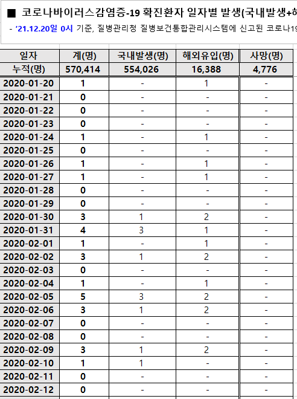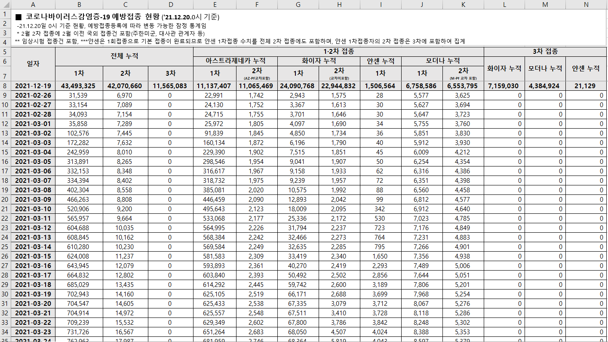 
        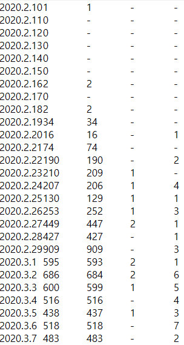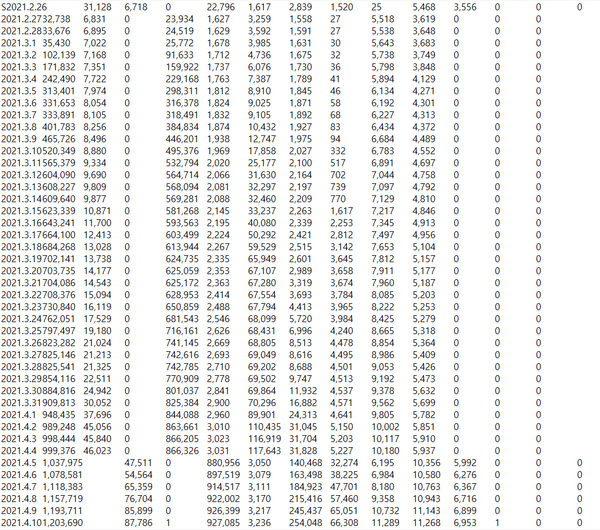 
         맨처음 질병관리청에서 받은 파일 형식을 엑셀파일시트였으며, 불필요한 헤더가 있어서 필요한 셀들만 복사해 vi로 txt 파일로 옮기고, 클래스를 따로 만들어 문자열을 숫자로 바꾸고 ,과 같은 필요없는 문자를
         제거하여 행렬형태로 변환하였습니다.. 
         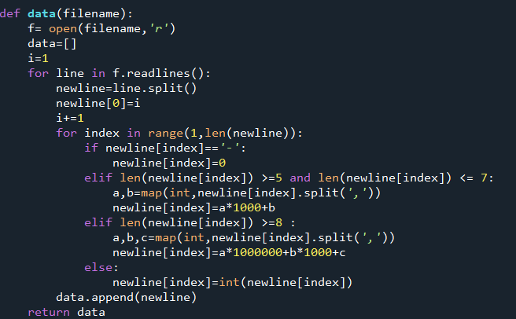
        

        

        사용한 라이브러리로는 numpy, matplotlib, pandas, scipy, statsmdoels 등이 있습니다.
        

        <h1>현재 확진자 추이</h1>
        

        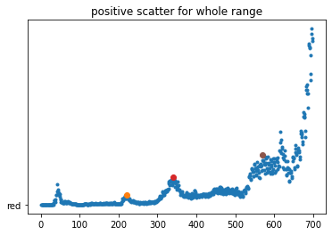 
        현재 확진자에 대한 분포를 나타내었습니다. 중간 중간에 색이 다른 점들은 일정 기간 내에 피크 포인트를 나타낸 것이며 위드코로나 이전 피크 포인트만 나타내었습니다. 여기서 위드코로나 전 후로 확진자 증가 양상이 달라져 전후로 따로 분석해야겠다고 생각했습니다.
        

        <h1>라인 피팅과 머신러닝으로 예측하는 확진자 수</h1>
        

        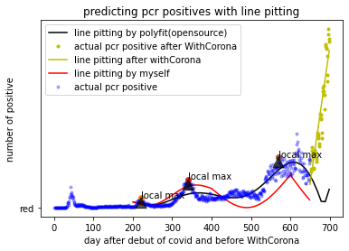 
        파란색으로 보이는 점들은 위드 코로나 전 실제 확진자수를 나타낸 것이고, 노란색 점들은 위드코로나 이후
        확진자 수의 분포입니다.  검은색 선은 np라이브러리의 poly_fit 함수를 사용하여 라인피팅을
        한 것입니다. 위드코로나 이전까지의 데이터로 피팅을 하였으며 선형으로는 맞지 않아 7차 다항식으로 피팅을 하였습니다. 
         그리고 노란색으로 된 선은 위드 코로나 이후의 데이터로 피팅을 하였고, 분포가 단순하여 1차로 피팅을
        했는데도 실제 데이터 분포와 매우 일치하는 것을 볼 수 있습니다. 
         위드코로나 이전의 데이터들로 라인피팅을 한 그래프(빨간색과 검은색)들로 예측을 한 결과 위드코로나가
        시행되지 않았다면 확진자수가 계속 폭증하지는 않고 어느정도는 다시 감소했다가, 다시 증가하였을 것으로
        예측됩니다.
        빨간색 라인은 제가 직접 분포를 보고서 선형결합으로 어느정도 표현할 수 있겠다
        라고 생각하고 직접 구성한 라인피팅이며, 일단 확진자수가 진동형태로 증가하며, 주기가 2배가 되며,
        진동을 하더라도 지역적인 평균 확진자수는 늘고 있어서 아래와 같은 함수로 작성했습니다. 
        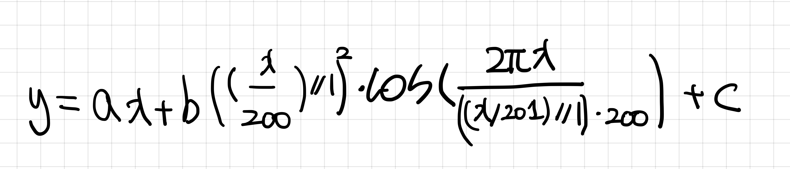
        여기서 y는 그 날의 확진자 수이며, x는 코로나가 처음 등장하여 정부에서 관리하기 시작한 날로부터 경과일입니다. 나날이 평균 확진자는 늘어가기때문에 1차항과 상수항을 사용하였고, 진동을 표현하기 위해서 sine wave를 사용하였습니다. 여기서 계수 a,b,c를 구하기 위해서 수업시간에 배웠던 역행렬을
        사용하였습니다. 
        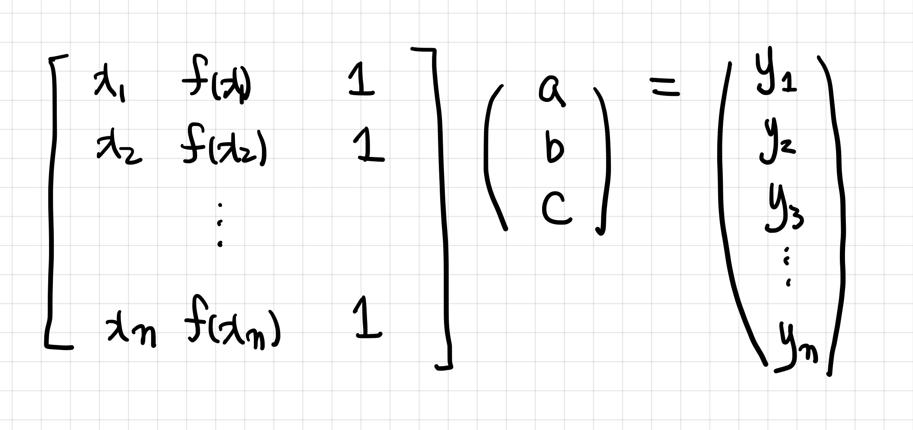 
        np 라이브러리에 있는 pinv 함수와 matmul을 이용하여 a,b,c를 구하였습니다. 하지만 실제 확진자 분포가 
        완전한 규칙을 가지고 있지 않아 선형결합의 해가 현실을 완벽하게 구하지는 않아서, 계수를 따로 보정해 
        주었습니다. 
        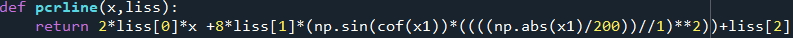 
        계수를 보정한 라인피팅 함수 여기서 liss는 선형결합의 해를 담은 배열. 
        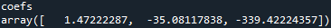 
        선형결합의 해를 구한 배열 
        

        <h1>사망률 추이 </h1>
        

        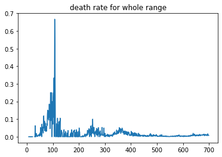 
        현재 사망률 추이를 가지고 왔습니다. 백신 접종에 대한 정보가 2021년 2월 부터이기 때문에 확진자수와 사망자수 또한 2월부터의 데이터로 백신 데이터와 함께 연결시켰습니다. 또한 사망률이 1아래의 숫자이기때문에 분석에 어려움이 있어 사망률에 10e6을 곱해주었습니다. 정말 신기한게 백신이 접종되기
        시작한 2월에 백신을 접종받지 않았기 때문에 사망률이 높았지만 국민의 90퍼센트 정도가 2차접종까지 완료한 상태에서 다시 사망률이 접종 10퍼센트 이하 때와 비슷해졌습니다. 이는 초반에 백신을 접종한 사람들이 현재에 와서 항체가 떨어졌다거나, 현재 확진자와 위중증환자 폭증으로 인하여 중증인데도 입원을 하지 못하여 사망률이 늘어난 것으로 생각됩니다.
        

        <h1>백신과 사망률</h1>
        
 이번에는 백신과 사망률에 대해서 분석을 해보았습니다. 먼저 실제 사망률과 백신접종률 사이의 표면적인 관계만 분석하여 라인피팅을 해 본 결과가 빨간색 곡선입니다. 양쪽 끝을 팍 튀는 점들을 제외하면 실제 분포와 유사합니다. 이 곡선에서 보다시피 백신접종률이 1에 가까워질수록 사망률이 증가합니다. 

        
    </body>
</html>